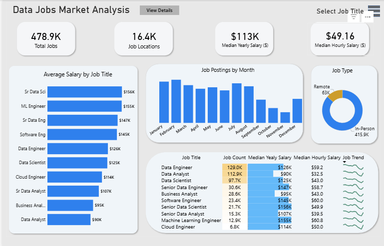
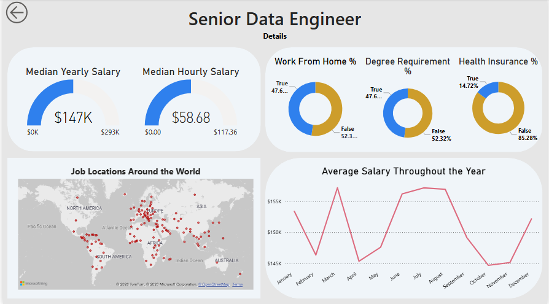

# 📊 Data Jobs Market Analysis Dashboard

An interactive Power BI dashboard analyzing approximately **479,000 data job postings** to uncover salary trends, hiring demand, remote work opportunities, and key insights across the data job market.

The report consists of a high-level dashboard with interactive filtering and a drill-through page for detailed analysis of individual job titles.

---

# Dashboard Preview

## Main Dashboard

## Drill Through Page

---

# Project Overview

This Power BI dashboard analyzes a large dataset of data-related job postings to provide insights into salaries, hiring trends, work arrangements, and job requirements.

The project answers business questions such as:

- Which data jobs have the highest median salaries?
- How many job postings exist for each role?
- How do salaries change throughout the year?
- What percentage of jobs are remote?
- Which jobs require a degree?
- Which jobs offer health insurance?
- Where are data jobs located around the world?

---

# Dashboard Features

## Main Dashboard

- KPI cards displaying:
  - Total Job Postings
  - Total Job Locations
  - Median Yearly Salary
  - Median Hourly Salary
- Average salary comparison by job title
- Monthly job posting trends
- Remote vs In-Person job distribution
- Interactive summary table with salary metrics and sparklines
- Job title slicer for filtering the report

---

## Drill Through Analysis

The report includes a dedicated drill-through page for role-specific analysis.

### How to access the drill-through page

1. Select a job title from the summary table located in the bottom-right corner of the main dashboard.
2. Right-click the selected row.
3. Select **Drill Through → Details**.

The drill-through page displays:

- Median yearly salary
- Median hourly salary
- Work From Home percentage
- Degree requirement percentage
- Health insurance percentage
- Global job location map
- Monthly salary trend for the selected job title

---

# Tools & Technologies

- Power BI
- Power Query
- DAX
- Data Modeling
- Interactive Data Visualization

---

# Key Insights

- Senior technical roles such as **Senior Data Scientist**, **Senior Data Engineer**, and **Machine Learning Engineer** command the highest median salaries.
- Remote work represents a significant portion of available data jobs.
- Hiring activity fluctuates throughout the year.
- Degree requirements vary depending on the role.
- Data jobs are concentrated primarily in North America and Europe.

---

# Skills Demonstrated

- Data Cleaning
- Data Transformation
- Data Modeling
- DAX Measures
- Interactive Dashboard Design
- Drill Through Navigation
- KPI Development
- Business Intelligence Reporting
- Data Visualization

---

# Dataset

This dashboard was built using a dataset containing approximately **479,000** data job postings across multiple data-related careers.

The dataset includes information such as:

- Job title
- Salary
- Job location
- Work arrangement (Remote / In-Person)
- Degree requirement
- Health insurance availability
- Job posting date

> **Note:** The original dataset is not included in this repository due to its file size.

---

# Future Improvements

- Add salary range filtering
- Include company-level analysis
- Add country-level drill-through pages
- Add forecasting for hiring trends
- Expand the dashboard with additional KPIs
